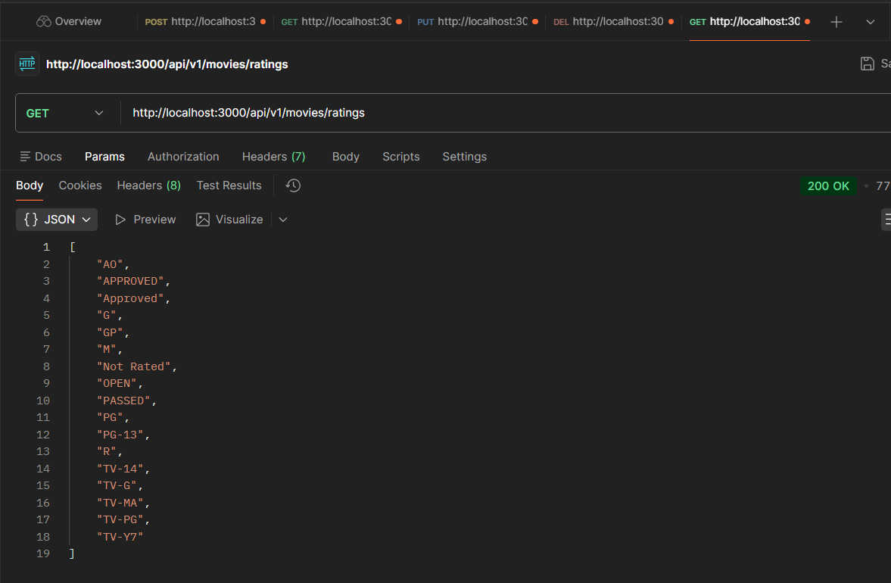
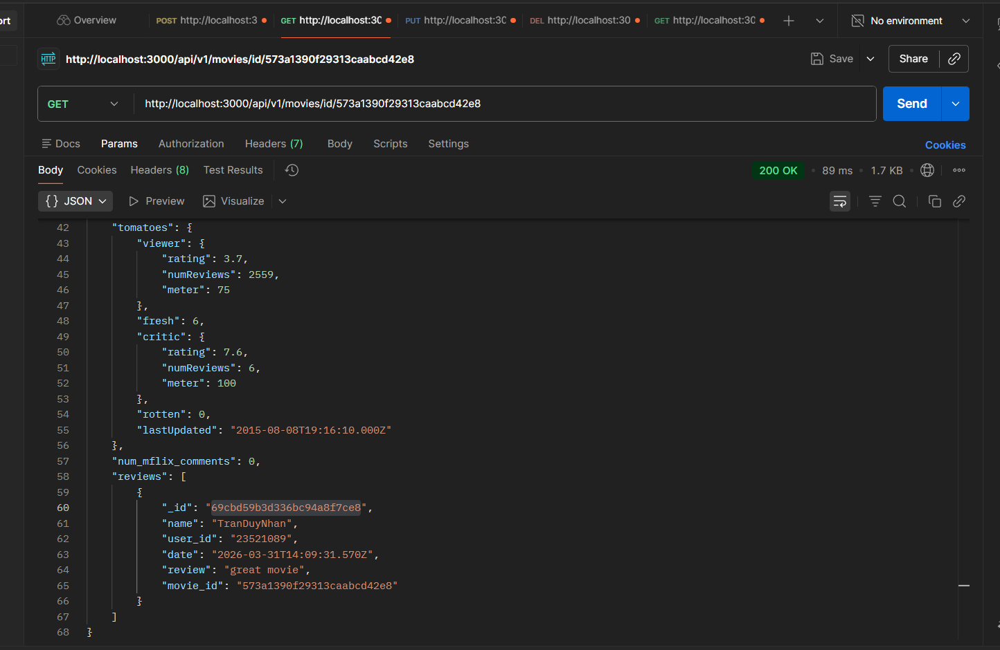
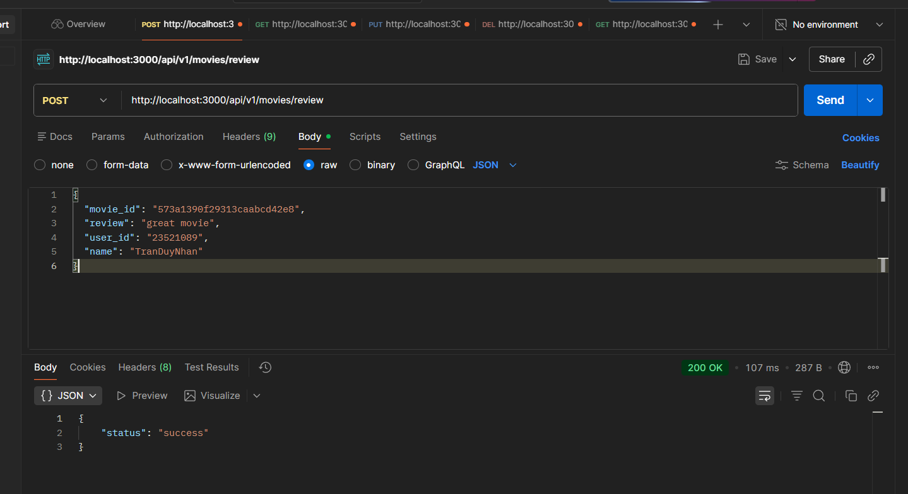
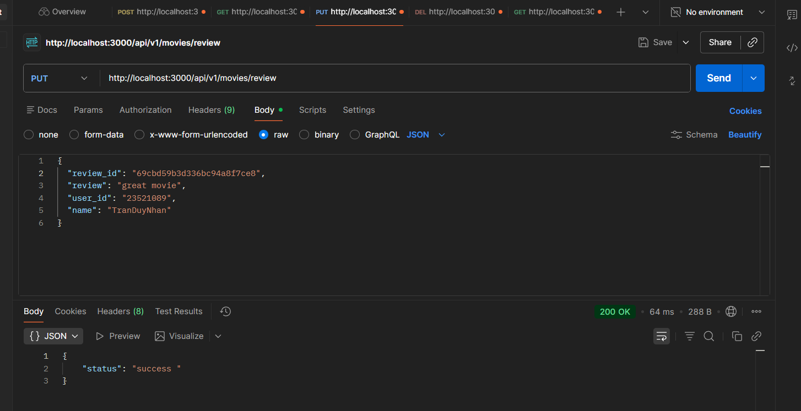
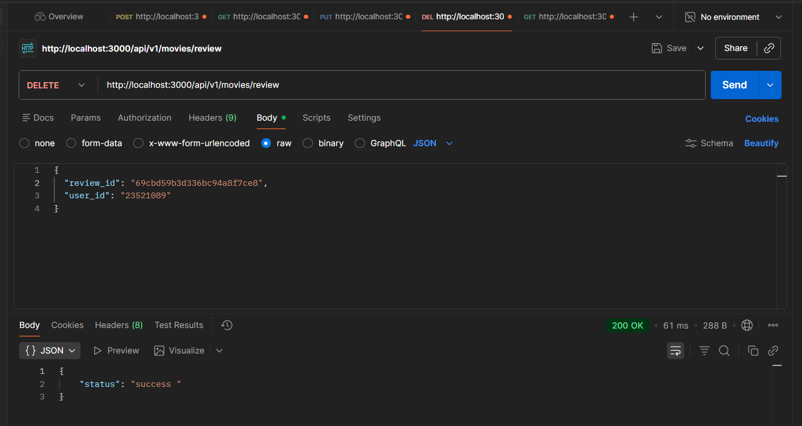

# Lab 03 - Ứng dụng Backend (Node.js & MongoDB)

## Thông tin sinh viên

- **Họ và tên**: Trần Duy Nhân
- **MSSV**: 23521089
- **Lớp**: IE213.Q21

## Tổng quan dự án

Đây là dự án xây dựng hệ thống RESTful API backend cho ứng dụng Đánh giá Phim (Movie Reviews) sử dụng Node.js, Express và MongoDB. Toàn bộ các yêu cầu của bài thực hành (Lab 03) đã được triển khai và kiểm thử thành công.

## Các chức năng đã hoàn thành

- **Bài 1 (Routing)**: Cấu hình các API endpoints cho `/review` (`POST`, `PUT`, `DELETE`), lấy thông tin phim theo ID (`/id/:id`), và lấy danh sách các nhãn đánh giá (`/ratings`).
- **Bài 2 (Reviews Controller)**: Khởi tạo các controller (`apiPostReview`, `apiUpdateReview`, `apiDeleteReview`) để xử lý dữ liệu gửi lên và gọi sang Data Access Object (DAO) tương ứng.
- **Bài 3 (Reviews DAO)**: Tích hợp MongoDB để thao tác với collection `reviews`, thực hiện các loại truy vấn CRUD thông qua hàm `insertOne`, `updateOne`, và `deleteOne`.
- **Bài 4 (Movies Controller & DAO)**: Bổ sung chức năng lấy chi tiết một bộ phim kèm theo danh sách các bình luận bằng thuật toán gộp bảng (`$lookup`) từ aggregation, và truy vấn mảng các phân loại đánh giá phân biệt.

## Hướng dẫn cài đặt & chạy dự án

1. Tạo một file `.env` ở thư mục `movie-reviews/backend/` và thêm vào các biến `MOVIEREVIEWS_DB_URI` cùng với `MOVIEREVIEWS_NS`.
2. Mở terminal truy cập vào thư mục `backend` và chạy lệnh sau:
    ```bash
    npm install
    npm run dev
    ```

---

## Hình ảnh Kết quả & Chạy thử các API


### 1. API Lấy danh sách Ratings

**Endpoint**: `GET /api/v1/movies/ratings`

- **Kết quả**: Truy xuất thành công mảng các nhãn phân loại "rated".
  


### 2. API Lấy thông tin Phim theo ID (Bao gồm danh sách Reviews)

**Endpoint**: `GET /api/v1/movies/id/:id`

- **Kết quả**: Truy xuất thành công thông tin một bộ phim, kèm theo toàn bộ mảng `reviews` đã được nối với nhau qua câu lệnh `$lookup`.
 

### 3. API Thêm Review mới

**Endpoint**: `POST /api/v1/movies/review`

- **Dữ liệu gửi**: `movie_id`, `review`, `user_id`, `name`
- **Kết quả**: Thêm thành công một document mới vào bảng `reviews`. Postman phản hồi `{"status":"success"}`.
  

### 4. API Chỉnh sửa Review

**Endpoint**: `PUT /api/v1/movies/review`

- **Dữ liệu gửi**: `review_id`, `user_id`, `review`
- **Kết quả**: Sửa thành công dòng text của review sao cho khớp với `review_id` và tài khoản sinh ra nó là `user_id`. Postman phản hồi `{"status":"success "}`.
  

### 5. API Xóa Review

**Endpoint**: `DELETE /api/v1/movies/review`

- **Dữ liệu gửi**: `review_id`, `user_id`
- **Kết quả**: Xóa hoàn toàn bản ghi review theo `review_id` và `user_id`. Postman phản hồi `{"status":"success "}`.
  
