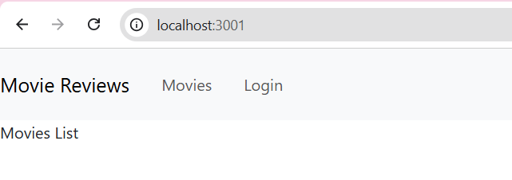
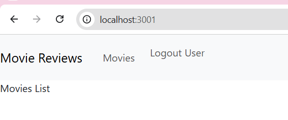

# Lab04 - Thiết lập Frontend với ReactJS (Movie Reviews)

## 1. Thiết lập môi trường làm việc

- Tạo React app trong thư mục `Lab04/frontend/` bằng lệnh:

    ```bash
    npx create-react-app frontend
    ```

- Cài đặt các package hỗ trợ (sau khi `cd Lab04/frontend`):

    ```bash
    npm install react-bootstrap bootstrap
    npm install react-router-dom@5
    ```

## 2. Các Component đã xây dựng

Tất cả component được tạo trong thư mục `Lab04/frontend/src/components/`:

| File             | Mô tả                                 |
| ---------------- | ------------------------------------- |
| `movies-list.js` | Hiển thị danh sách phim               |
| `movie.js`       | Hiển thị chi tiết phim kèm các review |
| `add-review.js`  | Hỗ trợ thêm review cho khách          |
| `login.js`       | Trang đăng nhập cho khách             |

## 3. Navigation Navbar và Định tuyến (App.js)

### Navbar

Navbar sử dụng React-Bootstrap với các thông tin:

- **Tên logo:** Movie Reviews
- **Liên kết 1:** Movies (điều hướng đến `/movies`)
- **Liên kết 2:** Hiển thị theo trạng thái đăng nhập:
    - Chưa đăng nhập → hiển thị `Login`
    - Đã đăng nhập → hiển thị `Logout User`

Trạng thái đăng nhập được quản lý bằng React hook `useState`:

```js
const [user, setUser] = React.useState(null);
```

### Định tuyến

Sử dụng `Switch` và `Route` từ **react-router-dom v5**:

| Đường dẫn            | Component    |
| -------------------- | ------------ |
| `/` hoặc `/movies`   | `MoviesList` |
| `/movies/:id/review` | `AddReview`  |
| `/movies/:id`        | `Movie`      |
| `/login`             | `Login`      |

## 4. Kết quả chạy ứng dụng

Khởi động ứng dụng:

```bash
cd Lab04/frontend
npm start
```

Mở trình duyệt tại `http://localhost:3000`.

### Navbar khi chưa đăng nhập



### Navbar khi đã đăng nhập



## 5. Cấu trúc thư mục

```text
Lab04/
├── README.md
├── screenshots/
│   ├── navbar-guest.png
│   └── navbar-logged-in.png
└── frontend/
    ├── package.json
    └── src/
        ├── App.js
        └── components/
            ├── movies-list.js
            ├── movie.js
            ├── add-review.js
            └── login.js
```
